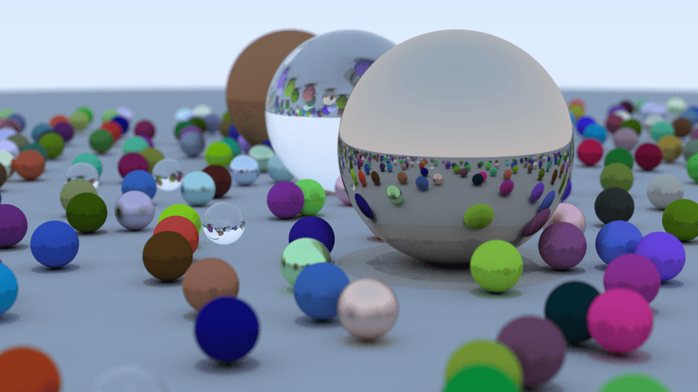

# CPU Ray Tracer

CPU ray tracer parallelized with OpenMP.

## Features

- Antialiasing
- Diffusion
- Reflection & refraction
- Camera positioning
- Defocus blur
- Multiprocessing parallelization

## Sample Image

## Reference

[Ray Tracing in One Weekend](https://raytracing.github.io/books/RayTracingInOneWeekend.html)

